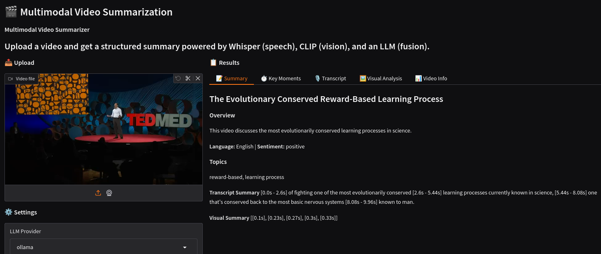

# VideoMind - Video Summarization 🎬
[](https://github.com/chungngoc/videomind/actions/workflows/ci_cd.yml)

Multimodal video summarizer that fuses **speech**, **visuals**, and **LLM reasoning**
into a single structured summary.

Upload any video → get key moments, topics, and a full transcript.

---
## Demo

Download a sample video to test:
- [Sample Video](https://www.youtube.com/watch?v=-moW9jvvMr4)
- Or use your own MP4 file

 

> Summarizing a 1-minute English video — Whisper transcription + CLIP visual analysis + LLaMA 3.2 fusion

## Architecture
```
Video → Preprocessing → ┌─ Whisper (audio)
                         └─ CLIP / BLIP-2 (frames)
                                    ↓
                           Multimodal fusion (LLM)
                                    ↓
                         Structured summary output
                                    ↓
                    ┌─ FastAPI (REST service)
                    ├─ Gradio (demo UI)
                    └─ MLflow + Docker (MLOps)
```

## Tech Stack

| Layer | Tool | Purpose |
|---|---|---|
| Frame analysis | CLIP / BLIP-2 | Visual understanding |
| Transcription | OpenAI Whisper | Speech to text |
| Summarization | LLaMA 3.2 / GPT-4o | Multimodal fusion |
| API | FastAPI | REST service |
| Demo | Gradio | Interactive UI |
| Experiment tracking | MLflow | Run history + metrics |
| Containerization | Docker | Reproducible deployment |
| CI/CD | GitHub Actions | Automated testing |

## Quickstart

### Requirements
- Python 3.10+
- ffmpeg (`sudo apt-get install ffmpeg`)
- Ollama (`curl -fsSL https://ollama.com/install.sh | sh`)

### Setup
```bash
git clone https://github.com/chungngoc/videomind.git
cd videomind
make setup
source venv/bin/activate

# Pull the LLM
ollama pull llama3.2:1b
```
### Test
```bash
make test # Run all tests
make check # Format + lint + test
```

### Run
```bash
# Start Ollama
ollama serve &

# FastAPI service
make dev           # → http://localhost:8000
                   # → http://localhost:8000/docs (Swagger UI)

# Gradio demo
make gradio        # → http://localhost:7860

# MLflow tracking UI
make mlflow        # → http://localhost:5000

```

## Project Structure
```
├── app/
│   ├── api/
│   │   └── routes.py          # FastAPI endpoints
│   ├── core/
│   │   └── config.py          # Centralized settings
│   ├── pipelines/
│   │   ├── preprocessing.py   # Frame extraction + audio split
│   │   ├── audio.py           # Whisper transcription
│   │   ├── visual.py          # CLIP frame analysis
│   │   └── fusion.py          # LLM summarization
│   ├── schemas/
│   │   ├── requests.py        # API request models
│   │   ├── responses.py       # API response models
│   │   └── summary.py         # VideoSummary schema
│   └── main.py                # FastAPI app entry point
├── gradio_demo/
│   └── app.py                 # Gradio UI
├── mlops/
│   └── mlflow/
│       └── mlflow_tracker.py  # MLflow tracking
├── tests/                     # Pytest suite
├── docs/
│   └── demo.png               # Demo screenshot
├── .github/workflows/         # CI/CD (coming soon)
├── Makefile                   # Dev commands
├── requirements.txt
└── setup.py
```

## API Reference

### `POST /api/v1/summarize`

Upload a video and get a structured summary.

**Request** — multipart/form-data:

| Field | Type | Default | Description |
|---|---|---|---|
| `file` | file | required | Video file (mp4, mov, avi, mkv, webm) |
| `llm_provider` | string | `ollama` | LLM provider: ollama or openai |
| `llm_model` | string | `llama3.2:1b` | Model name |
| `use_blip` | bool | `false` | Enable BLIP-2 captions |
| `top_k_frames` | int | `5` | Key frames to analyze |
| `frame_sample_rate` | int | `1` | Sample 1 frame every N seconds |

## MLflow Tracking

Every summarization run is automatically tracked. Launch the UI:
```bash
make mlflow   # → http://localhost:5000
```

Tracked per run:
- **Params** — model config (whisper size, LLM provider, use_blip)
- **Metrics** — processing time, word count, segments, key moments
- **Artifacts** — full summary JSON
